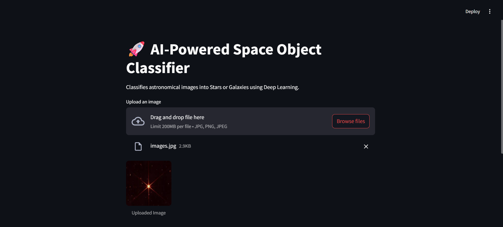
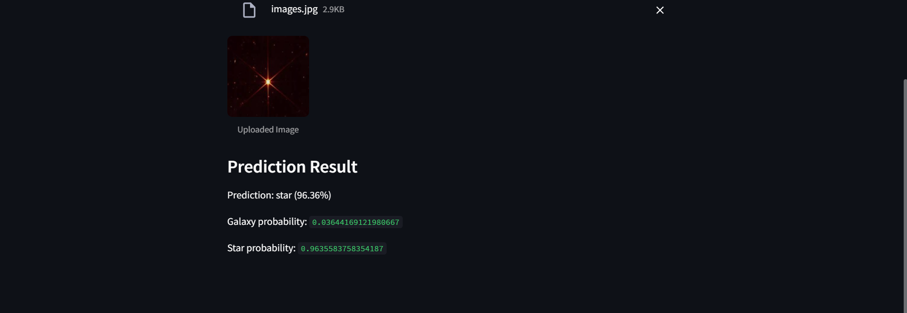

# AI-Powered Space Image Classifier

A deep learning-based web application that classifies astronomical images into **Stars** or **Galaxies** using Convolutional Neural Networks (CNN) and Streamlit.

---

## Features

* Classifies space images into **Star** or **Galaxy**
* Deep learning model using CNN
* Real-time prediction through a web interface
* Displays prediction confidence
* Clean and interactive UI

---

## Tech Stack

* Python
* TensorFlow / Keras
* Streamlit
* NumPy
* PIL (Image Processing)

---

## Demo

### Upload Interface



### Prediction Output



---

## How to Run

```bash
# Clone repository
git clone https://github.com/Eashanvi/Space-Image-Classifier.git

# Navigate to project folder
cd Space-Image-Classifier

# Install dependencies
pip install -r requirements.txt

# Run the app
streamlit run app.py
```

---

## 🖥️ App Versions

- **Gradio App (Hugging Face Deployment):** `app.py`
- **Streamlit App (Local UI):** `streamlit_app.py`

### ▶ Run Streamlit locally:
```bash
streamlit run streamlit_app.py

## Model Details

* Input size: 128 × 128 images
* Architecture: Convolutional Neural Network (CNN)
* Data Augmentation: Applied (flip, rotation, zoom)
* Optimizer: Adam
* Loss Function: Sparse Categorical Crossentropy

---

## Limitations

* Dataset is imbalanced (more stars than galaxies)
* Model may misclassify faint galaxies as stars
* Performance depends on image quality

---

## Future Improvements

* Use Transfer Learning (MobileNet / ResNet)
* Improve dataset balance
* Deploy on cloud (Streamlit Cloud / Hugging Face Spaces)
* Add more space object categories

---

## Author

**Eashanvi**
